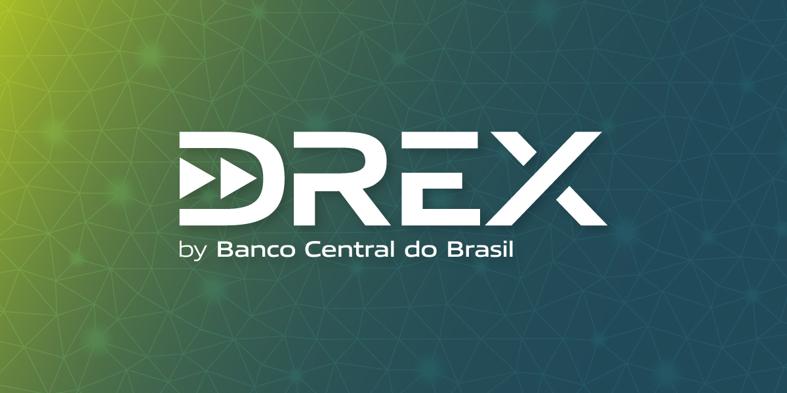

# From Real Digital to DREX

[https://www.bcb.gov.br/detalhenoticia/706/noticia](https://www.bcb.gov.br/detalhenoticia/706/noticia)

Drex: BC esclarece principais dúvidas sobre moeda digital

Publicado 11/08/2023 às 10:26

Desde o início das discussões referentes à moeda digital de banco central brasileira, agora denominada Drex, a Diretoria do BC considerou importante dar um nome específico à iniciativa de modo a simplificar a comunicação – assim como ocorreu na maior parte dos países. O processo de desenvolvimento da marca Drex se iniciou em 2022, quando os principais aspectos do modelo da CBDC brasileira já haviam se tornado mais claros. O intuito desse desenvolvimento foi o de padronizar a comunicação a respeito da iniciativa da moeda digital de banco central brasileira, permitindo que toda a comunicação se concentrasse no uso de uma única marca. Essa padronização evita a necessidade de se empregar na comunicação com o público em geral termos técnicos – como real digital, real tokenizado, plataforma de liquidações inteligentes ou smart contracts – comumente usados na comunicação técnica da iniciativa, mas que dificultam a compreensão para a maior parte da população.

O processo de ideação da marca Drex seguiu os moldes do desenvolvimento da marca Pix. Segundo o diretor Maurício, uma boa marca "ajuda no reconhecimento e na familiaridade com o produto". Na marca Drex, por fim desenvolvida pelo BC, a combinação de letras forma uma palavra com sonoridade forte e moderna: "d" e "r" fazem alusão ao Real Digital; o "e" vem de eletrônico e o "x" passa a ideia de modernidade e de conexão, do uso de tecnologia de registro distribuído (Distributed Ledger Tecnology – DLT), tecnologia adotada para o Drex, dando continuidade à família de soluções do BC iniciada com o Pix. Além disso, o conceito visual do Drex, que se encaixa no contexto da agenda de modernização tocada pelo Banco Central, a Agenda BC#open_in_new, tem como premissa a utilização de tipografia e elementos gráficos que remetem ao universo digital. Fazendo alusão a uma transação, as duas setas que se incluem no "d" têm relação com a evolução do Real para o ambiente digital, reforçando o atributo da agilidade, e o uso das cores, numa transição de azul para verde claro, passa a mensagem de "transação concluída".

LiveBC #10 - O que muda para mim com o Drex?

[https://www.youtube.com/watch?v=253qlxanAK4](https://www.youtube.com/watch?v=253qlxanAK4)

Streamed live on Aug 7, 2023
Anúncio do Drex como novo nome e marca da moeda digital. O impacto do Drex na vida das pessoas foi o assunto da Live BC.

Participantes: Gustavo Igreja, Aristides Cavalcante, Fabio Araujo

[https://www.bcb.gov.br/detalhenoticia/17946/nota](https://www.bcb.gov.br/detalhenoticia/17946/nota)

Nota à imprensa

A moeda digital brasileira ganha um nome e agora se chama Drex

Publicado 07/08/2023 às 14:27

O Drex está chegando para facilitar a vida dos brasileiros. De cara nova e nome próprio, nosso projeto de moeda digital de banco central (em inglês, Central Bank Digital Currency – CBDC), criado e operado pelo Banco Central do Brasil (BC), agora se chama Drex. A solução, anteriormente referida por Real Digital, propiciará um ambiente seguro e regulado para a geração de novos negócios e o acesso mais democrático aos benefícios da digitalização da economia a cidadãos e empreendedores.

[https://www.flickr.com/photos/bancocentralbr/53100738843/](https://www.flickr.com/photos/bancocentralbr/53100738843/)

- em agosto passou de Real Digital para DREX